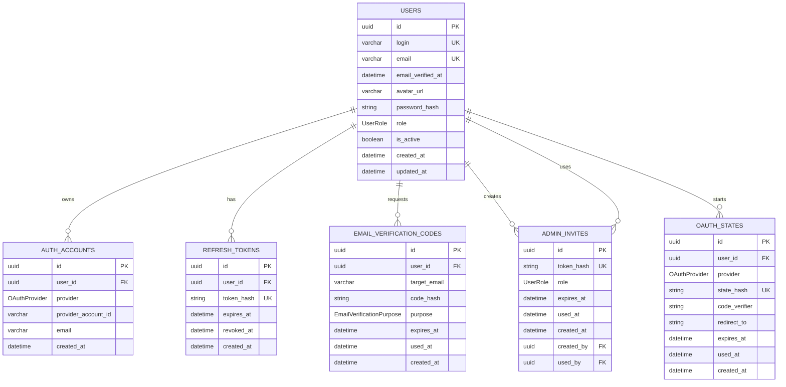

# Auth database

Связей many-to-many нет. Все связи явные one-to-many или optional one-to-one по смыслу использования invite.

## Таблицы

`users` хранит локальных пользователей, роль, статус подтверждения почты и ссылку на аватар. `password_hash` nullable, потому что OAuth-only пользователь может не иметь локального пароля. Роли: `ANALYST`, `ADMIN`, `SUPER_ADMIN`; `SUPER_ADMIN` создаётся seed-скриптом.

`auth_accounts` хранит внешние аккаунты Google/Yandex/VK. Один внешний аккаунт принадлежит одному пользователю. Уникальность: `(provider, provider_account_id)`.

`refresh_tokens` хранит только SHA-256 hash refresh token. Ротация refresh token выполняется при каждом `/api/auth/refresh`.

`email_verification_codes` оставлена как историческая таблица для возможного будущего подтверждения почты. Текущий runtime не отправляет SMTP-коды и не даёт пользователю менять email из личного кабинета.

`admin_invites` хранит одноразовые invite-link для создания администратора. В БД сохраняется только hash токена, а чистый token возвращается только один раз при создании. `created_by` и `used_by` используются для ограничения прав invite-администраторов.

`oauth_states` хранит короткоживущий OAuth `state`, чтобы callback нельзя было подделать или переиспользовать.
